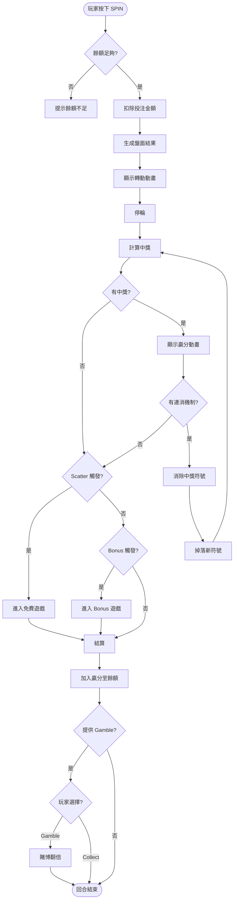
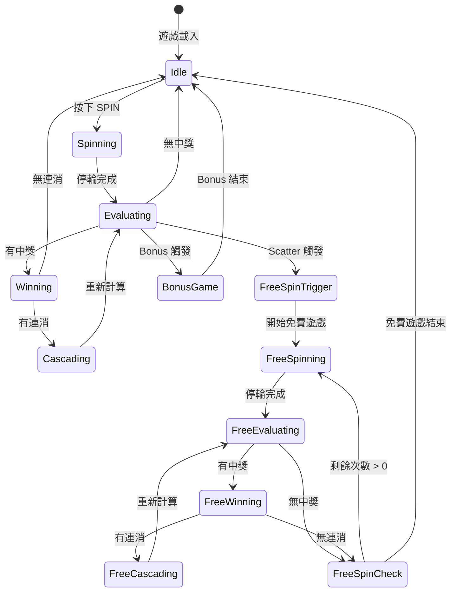
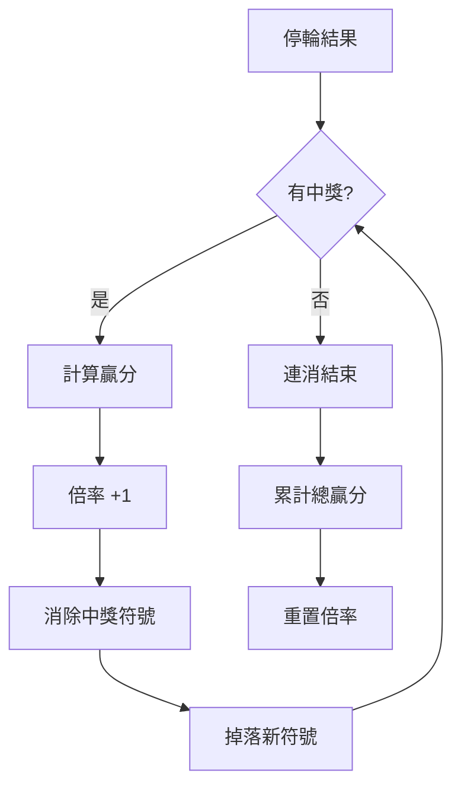
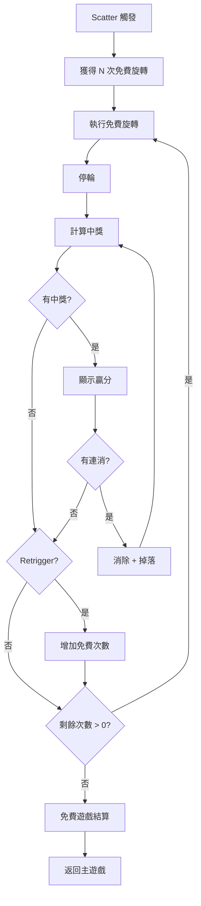
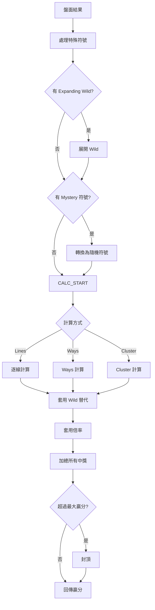
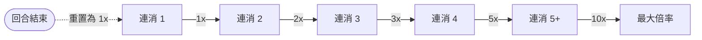
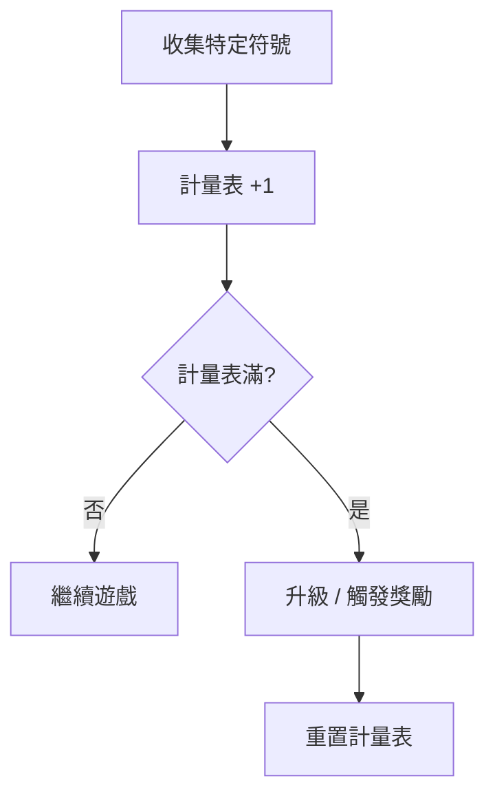
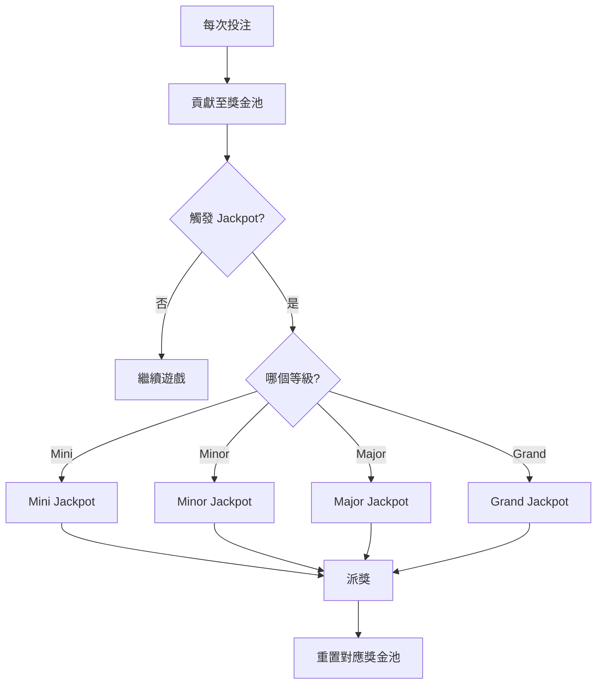
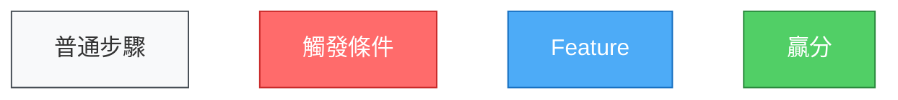

# 老虎機流程圖生成器 — Skill

> **用途**：分析老虎機遊戲程式碼，自動生成完整的遊戲流程圖（Mermaid 格式）。
> **使用方式**：把這份文件 + 遊戲程式碼路徑交給 AI，自動產出流程圖文件。
> **輸出格式**：Mermaid（可直接在 GitHub、GitLab、Markdown 編輯器中渲染）

---

## 指令

你是一位資深老虎機遊戲架構師。請分析指定的老虎機遊戲程式碼，生成完整的遊戲流程圖。

### Step 1：掃描程式碼，識別遊戲狀態

掃描以下關鍵字來識別遊戲的狀態和流程：

| 元件 | 關鍵字 | 用途 |
|------|--------|------|
| **主流程** | `spin`, `play`, `gameLoop`, `round`, `startRound` | 遊戲主循環 |
| **停輪** | `stop`, `reelStop`, `evaluate`, `calculateWin` | 停輪和計算 |
| **連消** | `cascade`, `tumble`, `avalanche`, `collapse`, `drop` | 消除重填循環 |
| **免費遊戲** | `freeSpin`, `freeGame`, `bonusSpin`, `triggerFree` | Free Spin 觸發和流程 |
| **Bonus** | `bonus`, `bonusGame`, `pickGame`, `wheel` | Bonus 遊戲 |
| **倍率** | `multiplier`, `progressiveMultiplier`, `increaseMultiplier` | 倍率系統 |
| **Jackpot** | `jackpot`, `progressive`, `grandPrize` | 累積獎金 |
| **Gamble** | `gamble`, `doubleUp`, `riskGame` | 賭博翻倍 |
| **Buy Feature** | `buyFeature`, `buyBonus`, `anteBet` | 購買功能 |
| **結算** | `settle`, `payout`, `collect`, `endRound` | 結算贏分 |
| **狀態管理** | `state`, `gameState`, `setState`, `phase` | 狀態機 |
| **Scatter 判定** | `checkScatter`, `scatterCount`, `isScatter` | Scatter 觸發判定 |
| **Wild 處理** | `expandWild`, `stickyWild`, `walkingWild`, `wildTransform` | Wild 特殊行為 |
| **Retrigger** | `retrigger`, `addFreeSpin`, `extraSpin` | 重新觸發 |
| **隨機功能** | `randomFeature`, `mysterySymbol`, `randomWild` | 隨機觸發的特殊功能 |
| **收集機制** | `collect`, `meter`, `fill`, `progress`, `counter` | 收集/計量表 |
| **分裂符號** | `split`, `colossal`, `megaSymbol` | 符號分裂/合併 |

### Step 2：識別流程圖類型

根據遊戲複雜度，需要生成以下流程圖：

| 流程圖 | 說明 | 必要性 |
|--------|------|--------|
| **主遊戲流程** | 從投注到結算的完整流程 | ✅ 必要 |
| **狀態機圖** | 遊戲所有狀態和轉換 | ✅ 必要 |
| **連消流程** | Cascade/Tumble 的迴圈 | 有連消時必要 |
| **Free Spin 流程** | 免費遊戲觸發到結束 | 有 Free Spin 時必要 |
| **Bonus 遊戲流程** | Bonus 的完整流程 | 有 Bonus 時必要 |
| **倍率系統流程** | 倍率怎麼增長和重置 | 有倍率系統時必要 |
| **Jackpot 流程** | 累積獎金觸發和派獎 | 有 Jackpot 時必要 |
| **中獎計算流程** | 從停輪到算出贏分 | ✅ 必要 |
| **符號處理流程** | Wild 展開、Mystery 轉換等 | 有特殊符號處理時必要 |

### Step 3：生成 Mermaid 流程圖

#### 3.1 主遊戲流程



#### 3.2 狀態機圖



#### 3.3 連消流程



#### 3.4 Free Spin 流程



#### 3.5 中獎計算流程



### Step 4：根據實際程式碼調整

以上是通用模板，需要根據實際程式碼：

1. **移除不存在的流程** — 沒有連消就刪掉 Cascade 相關
2. **新增特殊流程** — 如遊戲有獨特機制（如 Megaways 動態行數、Hold & Spin、Infinity Reels 等）
3. **標注具體數值** — 如 "獲得 10 次免費旋轉"、"倍率從 1x 開始，每次連消 +1"
4. **標注機率/權重** — 在判斷節點標上機率（如 "Scatter 觸發率 ≈ 1/150"）

### Step 5：生成額外圖表（如適用）

#### 5.1 倍率系統圖



#### 5.2 收集機制圖



#### 5.3 Jackpot 流程圖



---

## 輸出規範

### Mermaid 語法注意事項

1. **節點 ID 不能有空格或特殊字元** — 用英文縮寫
2. **中文顯示在方括號/圓括號內** — `NODE[中文說明]`
3. **判斷用菱形** — `{條件?}`
4. **起始/結束用雙圓** — `([文字])`
5. **子流程用雙方括號** — `[[子流程]]`
6. **虛線表示可選路徑** — `-.->` 

### 配色建議



---

## 品質檢查

生成完成後確認：

- [ ] 主遊戲流程圖涵蓋從投注到結算的所有步驟
- [ ] 狀態機圖包含所有可能的遊戲狀態
- [ ] 每個 Feature 都有獨立的流程圖
- [ ] 所有判斷節點（菱形）都有「是/否」兩條路徑
- [ ] 連消迴圈有明確的結束條件
- [ ] Free Spin 流程包含 Retrigger 判定
- [ ] 具體數值標注在流程圖中（如倍率、次數）
- [ ] Mermaid 語法正確，可以渲染
- [ ] 沒有孤立的節點（所有節點都連通）

---

## 使用方式

```
請讀取 slot-flowchart-generator/SKILL.md，
然後分析我的老虎機遊戲 {遊戲路徑}，生成完整的遊戲流程圖。
```

AI 會自動掃描程式碼 → 識別遊戲狀態和機制 → 生成 Mermaid 流程圖 → 輸出為 Markdown。

### 搭配使用

建議先跑 `slot-game-analyzer` 生成技術規格，再跑本 Skill 生成流程圖，兩份文件互相補充。
